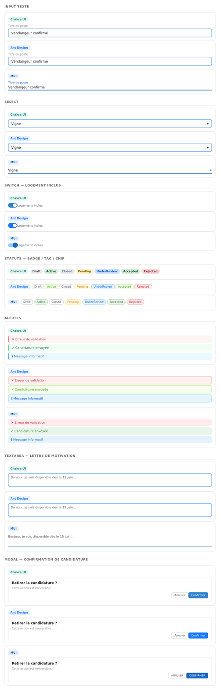

# Recherche de composants — LABOR

> **Objectif** : Identifier les bibliothèques de composants pour l'UI de LABOR — boutons, navigation, formulaires, cards, statuts, messages d'erreur.

---

## Sommaire

1. [Comparatif des bibliothèques](#comparatif-des-bibliothèques)
2. [Bibliothèques complémentaires](#bibliothèques-complémentaires)
3. [Aperçus visuels](#aperçus-visuels-des-composants)
4. [Composants par cas d'usage](#composants-par-cas-dusage)
   - [Navigation](#navigation)
   - [Authentification](#authentification--user--role)
   - [Profil agriculteur](#profil-agriculteur--farmer--farm)
   - [Profil saisonnier](#profil-saisonnier--seasonalworker)
   - [Annonce](#annonce--joblisting)
   - [Statuts](#statuts--joblistingstatus--applicationstatus)
   - [Candidature](#candidature--application)
   - [Messages d'erreur & alertes](#messages-derreur--alertes)
5. [Recommandations](#recommandations)

---

## Comparatif des bibliothèques

| Bibliothèque | Licence | Type | Style | Lien | GitHub |
|---|---|---|---|---|---|
| **Chakra UI** ✅ | MIT | Composants React modulaires et accessibles | Neutre, entièrement thémable | [chakra-ui.com](https://www.chakra-ui.com/docs/components/) | [chakra-ui/chakra-ui](https://github.com/chakra-ui/chakra-ui) |
| **Ant Design** | MIT | Composants React orientés applis métier | Structuré, professionnel | [ant.design](https://ant.design/components/overview/) | [ant-design/ant-design](https://github.com/ant-design/ant-design) |
| **Material UI** | MIT | Composants React Material Design | Géométrique, 5 variantes par composant | [mui.com](https://mui.com/material-ui/all-components/) | [mui/material-ui](https://github.com/mui/material-ui) |
| **shadcn/ui** | MIT | Composants copiables, basés sur Radix + Tailwind | Headless, theming Tailwind natif | [ui.shadcn.com](https://ui.shadcn.com/docs/components) | [shadcn-ui/ui](https://github.com/shadcn-ui/ui) |
| **Radix UI** | MIT | Primitives headless accessibles | Aucun style par défaut, ARIA complet | [radix-ui.com](https://www.radix-ui.com/primitives/docs/overview/introduction) | [radix-ui/primitives](https://github.com/radix-ui/primitives) |
| **React Aria (Adobe)** | Apache 2.0 | Composants accessibles orientés mobile | Headless, gestion native des formats FR | [react-spectrum.adobe.com](https://react-spectrum.adobe.com/react-aria/index.html) | [adobe/react-spectrum](https://github.com/adobe/react-spectrum) |

---

## Bibliothèques complémentaires

### shadcn/ui

shadcn/ui ne s'installe pas comme une dépendance : les composants sont copiés directement dans le code et adaptés librement. Le style est défini uniquement via Tailwind CSS, ce qui donne un contrôle total sur les couleurs LABOR (Fern, Golden Orange…). Particulièrement fort sur les composants `Combobox` (idéal pour le champ `skills[]` du saisonnier), `Select` (pour `cropType`, `workSchedule`, `paymentType`), et `Date Picker`.

### Radix UI

Radix UI est la base sur laquelle shadcn/ui est construit. Il peut être utilisé seul pour construire des composants sur-mesure avec le style LABOR. Zéro style par défaut, accessibilité ARIA complète. Très utile pour les composants complexes comme `Select`, `Dialog`, `Tabs` (navigation entre Farmer/SeasonalWorker), `Toggle Group` (sélection du `WorkSchedule` ou du `Role`).

### React Aria Components (Adobe)

Conçu par Adobe pour des applis terrain avec des utilisateurs très variés, ce qui colle aux valeurs **Simplicité** et **Proximité** de LABOR. Le `DateRangePicker` est particulièrement soigné (meilleur que celui d'Ant Design sur mobile) et gère nativement les formats de dates français. Utile pour `availabilityStart`/`availabilityEnd` côté saisonnier et `startDate`/`endDate` côté annonce.

| Bibliothèque | Licence | Pourquoi pour LABOR |
|---|---|---|
| **shadcn/ui** | MIT | Theming Tailwind natif, Combobox skills, Select enums |
| **Radix UI** | MIT | Primitives headless pour composants sur-mesure |
| **React Aria** | Apache 2.0 | DateRangePicker mobile FR, accessibilité maximale |

---

## Aperçus visuels des composants

> 📸 *Aperçu visuel des composants — voir les captures d'écran jointes au document.*

---

## Composants par cas d'usage

### Navigation

| Composant | Usage dans LABOR | Chakra | Ant Design | MUI |
|---|---|---|---|---|
| Bottom Navigation | Navbar mobile — Home / Offres / Profil |  |  |  |
| Top Bar | En-tête avec retour et titre de page | — |  |  |
| Breadcrumb | Accueil > Offres > Détail annonce |  |  |  |

---

### Authentification — `User` / `Role`

| Composant | Usage dans LABOR | Chakra | Ant Design | MUI |
|---|---|---|---|---|
| Input email | Champ `email` à l'inscription / connexion |  |  |  |
| Input password | Champ `passwordHash` à la connexion |  |  |  |
| Radio group | Choix du rôle `Farmer` / `SeasonalWorker` |  |  |  |

---

### Profil agriculteur — `Farmer` / `Farm`

| Composant | Usage dans LABOR | Chakra | Ant Design | MUI |
|---|---|---|---|---|
| Input texte | `farmName`, `siret`, `proPhoneNumber` |  |  |  |
| Input texte | `city`, `postalCode`, `departement` |  |  |  |
| Card exploitation | Affichage d'une `Farm` avec ses annonces |  |  |  |

---

### Profil saisonnier — `SeasonalWorker`

| Composant | Usage dans LABOR | Chakra | Ant Design | MUI |
|---|---|---|---|---|
| Input texte | `city`, `postalCode`, `departement` |  |  |  |
| Checkbox groupe | Sélection des `skills[]` (Harvesting, Viticulture…) |  |  |  |
| DatePicker range | `availabilityStart` / `availabilityEnd` | — (lib externe) |  |  |

---

### Annonce — `JobListing`

| Composant | Usage dans LABOR | Chakra | Ant Design | MUI |
|---|---|---|---|---|
| Input texte | `jobTitle`, `description` |  |  |  |
| Select | `cropType` — Cereals, Fruits, Vineyard… |  |  |  |
| Select multiple | `workSchedule` — FullTime, Night, Weekend… |  |  |  |
| Checkbox groupe | `skills[]` requis pour le poste |  |  |  |
| Input nombre | `numberOfPositions` |  |  |  |
| Input montant | `payAmount` + `paymentType` (Hourly / Weekly / Monthly) |  |  |  |
| Switch | `housingProvided` — logement inclus |  |  |  |
| DatePicker range | `startDate` / `endDate` de la mission | — (lib externe) |  |  |
| Card annonce | Résumé d'une `JobListing` dans les résultats |  |  |  |

---

### Statuts — `JobListingStatus` / `ApplicationStatus`

| Statut | Composant recommandé | Chakra | Ant Design | MUI |
|---|---|---|---|---|
| `Draft` | Badge / Tag neutre |  |  |  |
| `Active` | Badge / Tag vert |  |  |  |
| `Closed` | Badge / Tag gris |  |  |  |
| `Pending` | Badge / Tag orange |  |  |  |
| `UnderReview` | Badge / Tag bleu |  |  |  |
| `Accepted` | Badge / Tag vert |  |  |  |
| `Rejected` | Badge / Tag rouge |  |  |  |

---

### Candidature — `Application`

| Composant | Usage dans LABOR | Chakra | Ant Design | MUI |
|---|---|---|---|---|
| Card candidature | Récapitulatif d'une `Application` dans la liste |  |  |  |
| Modal confirmation | Confirmation ou retrait de candidature |  |  |  |

---

### Messages d'erreur & alertes

| Composant | Usage dans LABOR | Chakra | Ant Design | MUI |
|---|---|---|---|---|
| Alerte erreur | Erreur de validation / API |  |  |  |
| Alerte succès | Confirmation d'action réussie |  |  |  |
| Alerte info | Message informatif contextuel |  |  |  |
| Toast | Notifications éphémères |  |  |  |

---

## Recommandations

### Recommandation 1 — Chakra UI ✅

Chakra UI dispose d'un fichier de configuration unique où l'on peut définir une seule fois toutes les règles visuelles de LABOR — les couleurs, les polices, les coins arrondis. Une fois ce fichier rempli, tous les composants de l'app les appliquent automatiquement sans répétition dans le code. L'accessibilité est intégrée par défaut, ce qui est important pour une app terrain destinée à des publics variés (maraîchers, étudiants, saisonniers).

### Recommandation 2 — Ant Design (DatePicker uniquement)

Ant Design est retenu uniquement pour un composant : le sélecteur de dates. C'est central dans LABOR puisque les deux côtés de la plateforme en ont besoin — l'agriculteur indique quand il a besoin de main d'œuvre, et le saisonnier indique sa disponibilité. Ant Design propose un `RangePicker` qui permet de sélectionner une période avec un début et une fin en un seul composant.